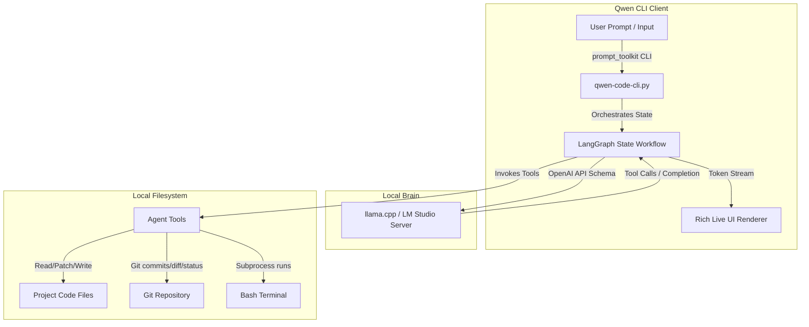

# 🤖 Qwen Code CLI v2.0 — Claude Code Style

> A local AI Coding Agent running 100% locally on your machine with a Rich UI and features aligned with Claude Code.

---

## 📐 1. Architecture

The system operates as a local agentic loop, binding a local OpenAI-compatible inference server to physical workspace tools using LangGraph:



---

## 🔄 2. Workflow

1. **User Input Handling**: The user types text or commands. Slash commands (e.g. `/compact`, `/reset`, `/git`) are evaluated locally immediately to bypass LLM latency.
2. **LangGraph Loop**: Text queries are dispatched to the LangGraph execution loop:
   - **LLM Node**: Streams prompt inputs to the local model.
   - **Stream Capture**: If a plain text reply is streamed, it renders live in a markdown panel. If tool call tokens are emitted, it intercepts the output.
   - **Tool Execution Node**: Executes corresponding python operations (file changes, grep searches, git commands). Dangerous commands (like `rm` or `sudo`) trigger an visual Confirmation Gate.
3. **Iteration Cap**: The loop runs up to `MAX_ITERATIONS = 20` times to resolve multi-step operations.
4. **Context Management**: Older chat logs are trimmed or auto-compressed using a summarization node if they exceed `MAX_HISTORY_MSGS = 40` to save context space.

---

## 🛠️ 3. Tool Techstack

* **Agent Core**: Python 3.8+, LangGraph, LangChain Core, `langchain-openai`.
* **Terminal Interface**: `prompt_toolkit` (persistent input history, auto-completion, suggestions), `rich` (Markdown rendering, diff colorization, progress spinners).
* **Workspace Integration**: `gitpython` (native Git API wrapper), standard subprocesses.
* **Brain Engine (Local Inference)**: `llama.cpp` server or `LM Studio` running GGUF weights (e.g. `qwen2.5-7b-instruct`).

---

## 🗂️ 4. Project Structure

```
qwen-cli/
├── qwen-code-cli.py       # Core agent execution runner, tool definitions, & LangGraph workflow
├── readme.md              # Project documentation
├── SKILL.md               # Detailed tool bindings and system configuration documentation
├── doc.txt                # Interactive startup guide
├── requirement.txt        # python dependencies list
├── requirements.txt       # python dependencies list (duplicate for compatibility)
├── scan_for_test.py       # Scanner test runner script
├── models/                # Local directory for placing downloaded GGUF models
└── venv/                  # Local python virtual environment
```

---

## 🚀 5. How to Setup

### 1. Install Dependencies
Set up your virtual environment and install the required modules:
```bash
python3 -m venv venv
source venv/bin/activate
pip install -r requirements.txt
```

### 2. Startup your Local LLM Server
Ensure you have `llama.cpp` or `LM Studio` running and hosting your model on port `8888` or `8080`.
```bash
# Example command using llama-server hosting Qwen GGUF:
llama-server -m models/qwen2.5-7b-instruct-q4_k_m-00001-of-00002.gguf --port 8080 --n_ctx 2048 --verbose False
```

### 3. Configure and Launch the CLI
By default, the client points to `http://127.0.0.1:8080/v1`. Start the interface using:
```bash
python qwen-code-cli.py
```

*Inside the CLI, type `/help` to see all available slash commands.*
